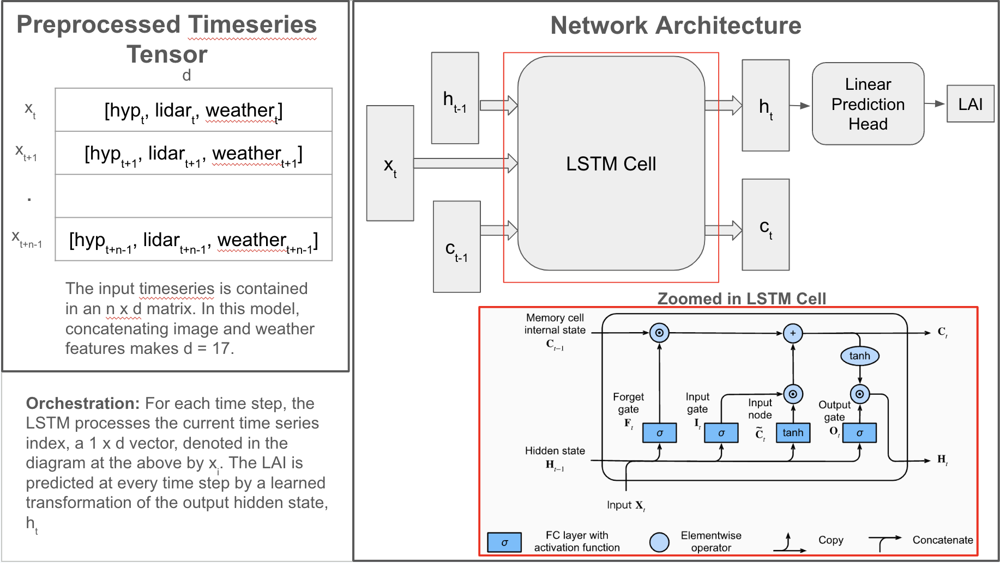
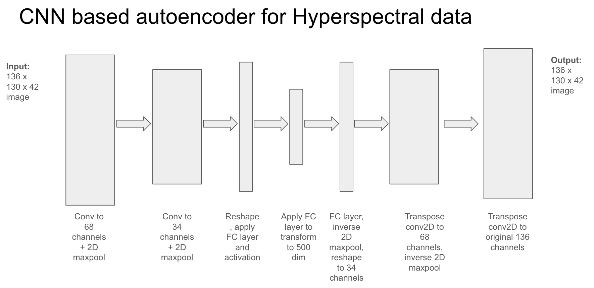

# Overview:
This repository contains all the code used to do prediction of LAI using UAV based hyperspectral and LiDAR observations.
Furthermore, weather features like precipitaion and growing degree days are also incorporated into the model.

There is a significant amount of pre-processing, which is found in the /dataloading and /hyperspectral_lidar_processing folders. 

# Image and feature preprocessing:
The main goal of /hyperspectral_lidar_processing is to load the hyperspectral and LiDAR data and break it up by each subplot. This requires loading subplot metadata, using geospatial transforms to crop each subplot by the subplot meatadata. The end result stores each subplot's LiDAR and hyperspectral data in its own numpy file. Paths to these files are stored in a pandas database which is accessible to downstream tasks.

The main goal of /dataloading_scripts is to use the database created in /hyperspectral_lidar_prcessing and load up the hyperspectral and LiDAR data in various ways for different machine learning and deep learning models. Specifically, features_dataloader.py loads hyperspectral and LiDAR indices along with weather data in timeseries and feeds the entire timeseries to downstream models.

hyperspectra_lidar_weather_dataloader.py loads the hyperspectral and LiDAR data individually (i.e, without being part of a timeseries) or as an entire timeseries of observations. The transformations to torch tensors, handling varying point cloud sizes, and stratification strategy for sampling is built into these dataloaders.

# Models:
The acutal model code is found in the /models folder. 

The statistical machine learning model is the support vector regression. Call statistical_model() with cv_stratify=True means we will do 10 fold cross validation and make sure we have an equal proportion of hybrid and inbreds as is reflected in our existing dataset in our train and test splits. I will add a command line command to kick off the SVR

The LSTM deep learning model is in the models.py file. Training and testing this LSTM is done with train_and_test_RS_features.py. Command line arguments to customize the hidden state size will be added. Command line arguments will also be added to use the pretrained model.

Autoencoder models to build neural representations of LiDAR and hyperspectral data are in models.py as well. To train the hyperspectral autoencder, the code is in train_hyp_ae.py. For the LiDAR data encoding, one can use train_lidar_ae.py.

The plan is to build a transformer network for predicting LAI at every timestep. I will add code to train and test this model.

### 
LSTM architecture:

Hyperspectral autencoder architecture:

