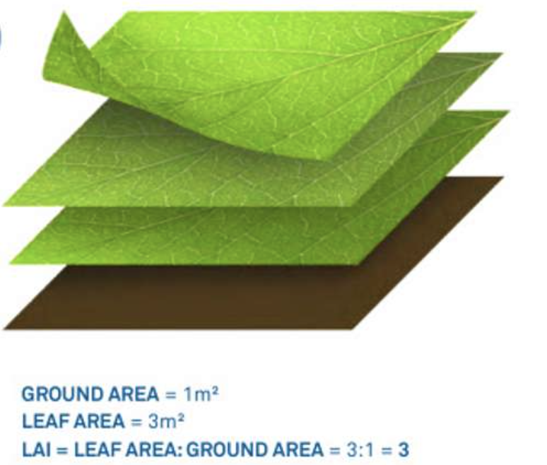
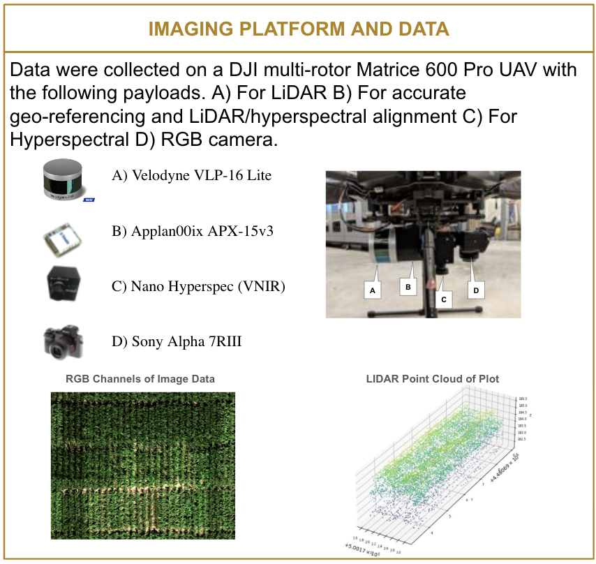
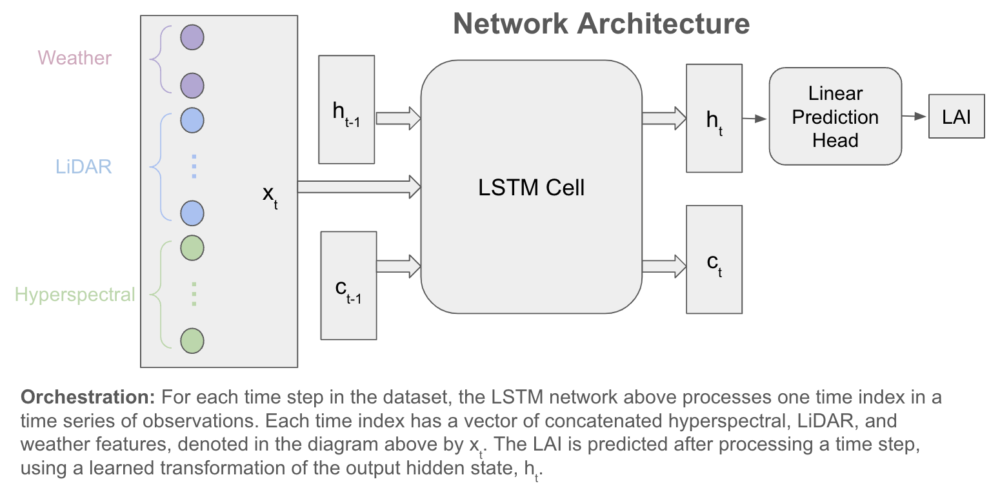

# Introduction:
This repository contains all the code used to do prediction of Leaf Area Index (LAI) using drone based hyperspectral, LiDAR, and weather observations.

LAI is defined as the one sided leaf area divided by a ground area. See below for an intuitive visualization:

   
  

#### Importance of LAI: ####
 - Indicator of photosynthetic capability of vegetation canopies
 - Important trait for agriculture yield prediction. 
 - Uses from climate modeling, crop yield forecasting, plant breeding.

There is a significant amount of pre-processing, which is found in the /dataloading and /hyperspectral_lidar_processing folders. 

# Image and feature preprocessing:
The main goal of /hyperspectral_lidar_processing is to load the hyperspectral and LiDAR data and break it up by each subplot. This requires loading subplot metadata, using geospatial transforms to crop each subplot by the subplot meatadata. The end result stores each subplot's LiDAR and hyperspectral data in its own numpy file. Paths to these files are stored in a pandas database which is accessible to downstream tasks.

The main goal of /dataloading_scripts is to use the database created in /hyperspectral_lidar_prcessing and load up the hyperspectral and LiDAR data in various ways for different machine learning and deep learning models. Specifically, features_dataloader.py loads hyperspectral and LiDAR indices along with weather data in timeseries and feeds the entire timeseries to downstream models.

hyperspectra_lidar_weather_dataloader.py loads the hyperspectral and LiDAR data individually (i.e, without being part of a timeseries) or as an entire timeseries of observations. The transformations to torch tensors, handling varying point cloud sizes, and stratification strategy for sampling is built into these dataloaders.

# Models:
The acutal model code is found in the /models folder. 

#### Statistical Machine Learning: ####
The statistical machine learning model is the support vector regression. Call statistical_model() with cv_stratify=True means we will do 10 fold cross validation and make sure we have an equal proportion of hybrid and inbreds as is reflected in our existing dataset in our train and test splits. I will add a command line command to kick off the SVR

#### Sequence Based - Long Short Term Memory (LSTM) ####
The LSTM deep learning model is in the models.py file. Training and testing this LSTM is done with train_and_test_RS_features.py. Command line arguments to customize the hidden state size will be added. Command line arguments will also be added to use the pretrained model.

#### Hyperspectral Autoencoder ####
Autoencoder models to build neural representations of LiDAR and hyperspectral data are in models.py as well. To train the hyperspectral autoencder, the code is in train_hyp_ae.py. For the LiDAR data encoding, one can use train_lidar_ae.py.

#### Sequence Based - Transformer ####
The transformer currently takes in each timestep of remote sensing feature as an embedding, projects this embedding to the query, key, and value vectors stacked in Q, K, V matrices. We then perform standard self attention using the Q, K, V matrices. I use the first generatation transformer architecture outlined in Vaswani (2017), where residual connection is done before the layer normalizations. To improve the model, I plan on adding multiple transformer blocks (currently, there is only one transformer block which reduces the number of parameters in this model compared to the number of training data points, possibly leading to some underfitting).

# Model Architectures:
LSTM architecture::

Hyperspectral autencoder architecture:

Transformer architecture will be added.